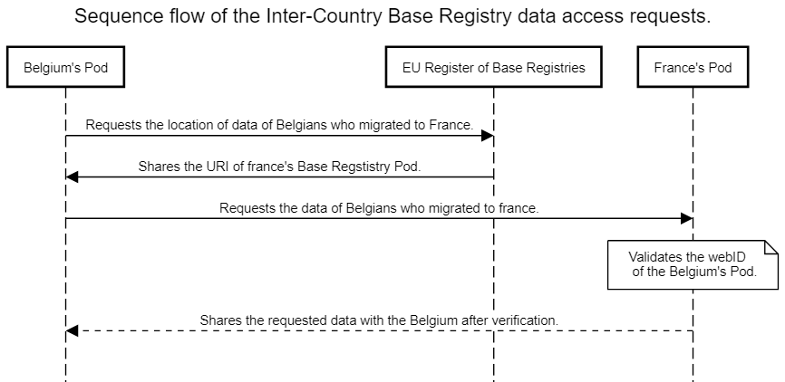

# SemicMigrationPilotDataExample
This repository provides a sample data for Registry of Base Registries in DCAT specification in the EU-Pod and  for Base Registry in LDES Specification in the member country-specific-Pod for the pilot on EU citizen migration data interoperability.

The main goal of this pilot is to demonstrate how the technological principles of LDES and Solid, can facilitate data interoperability across EU member states, while maintaining proper access control management.

## Use case rationale
This use case aims to allow official actors from EU Member States (MS) to consult citizen registration/deregistration information about their own citizens in other MS, in a privacy-aware manner. As an example, the pilot should provide the means to support the following scenario:

An authorized officer of the Greek government wants to know how many Greek citizens have moved into Luxembourg in the last 2 years, while respecting personal data privacy constraints.

## Pilot design considerations
Given the privacy sensitive nature of the data, this pilot will be built using fictitious data representing citizens from multiple MS.

Designing a fully fledged data model, applicable for all MS, is not in scope for this pilot. Yet, reuse of the EU Core Person vocabulary to model citizens data is considered. 

The pilot assumes that for every MS, there is an authoritative and nation-wide citizen Base Registry (BR), which will be published following the LDES and Solid specifications.

Published MS citizen BRs as LDES/Solid data sources shall be described in an EU-wide data catalog, based on the BregDCAT-AP specification.

This pilot envisions the development of a user Web application that should allow: 
User authentication (following Solid protocols)
Data discovery based on available BregDCAT-AP catalog(s)
Display of migratory information, according to the access control rules defined by every published MS BR.

## Technical design

### Data model
**Setup:** A registry of base registries is maintained by EU(European Union) using the DCAT spec which contains datasets that point to the individual countries’ base registries. The data registries contain individual countries’ citizen data. An illustrative example is provided here for when a country (say France) request’s data of the French citizens migrated to another Country (say Belgium).

[Example Base Registry Pod for France (Pod-Fr)](example_France_BaseRegistry_Pod)  

[Example Registry of Base Registries (Pod-EU)](example_EU_RegistryofBaseRegistries_Pod)

### System architecture
**Scenario:** If France wants to see how many of its citizens migrated to Belgium over the past year, then it sends a request to EU requesting the info, of those who migrated to Belgium with their previous domicile as France, from the base registry of Belgium. 

Figure 1 Block diagram of the Inter-Country Base Registry architecture
